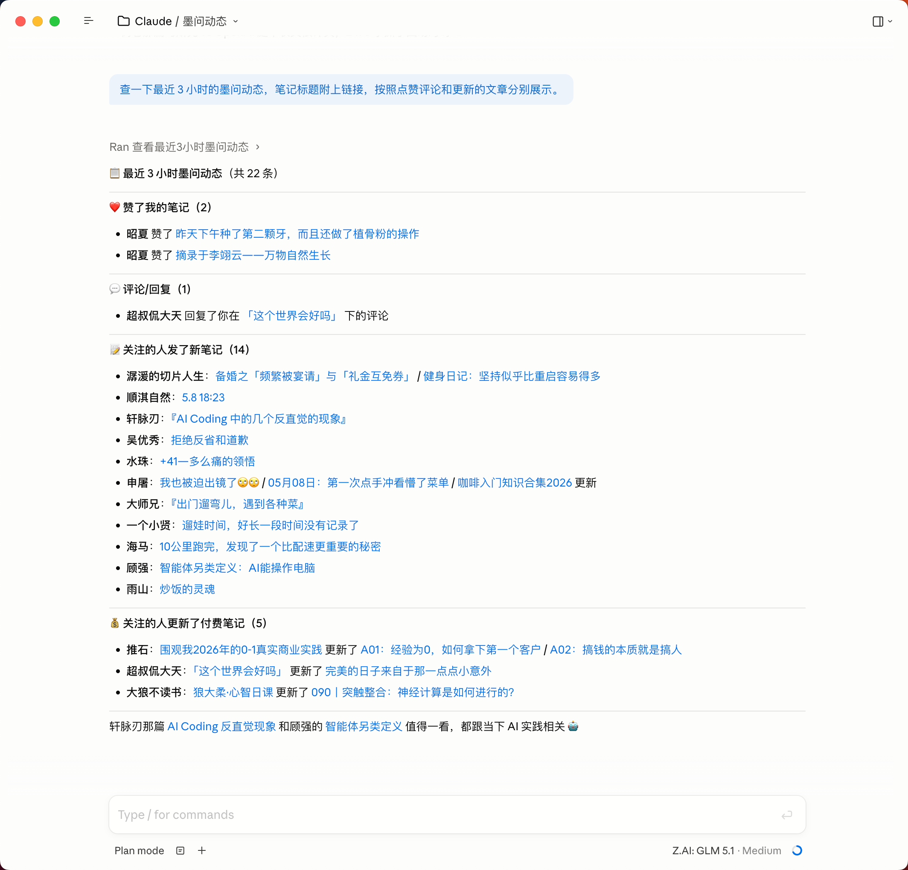
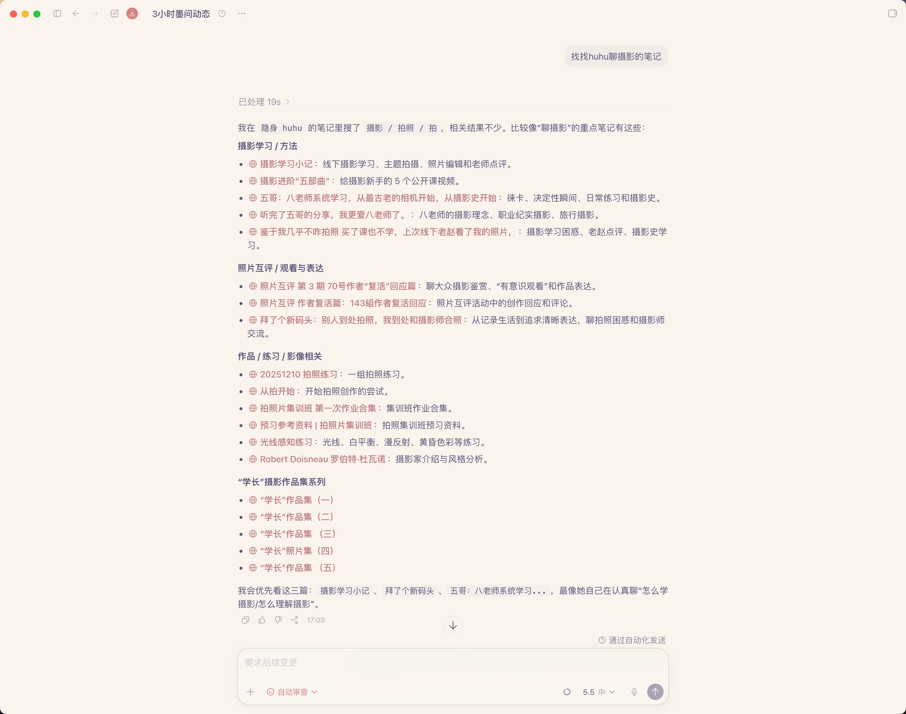
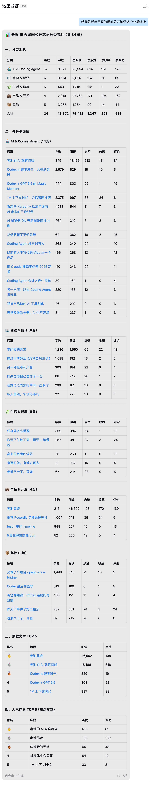

# mocli

这里是墨问官方 CLI 工具、墨问官方 Skill 仓库。安装 mocli 和相关 Skills 之后，墨问用户可以使用自然语言在 AI Agent 工具里使用墨问，比如查看我的笔记、查询墨问动态、搜索用户等等，后续会增加更多功能，比如创建笔记等。

mocli 和 Skills 一次安装，所有 Agent 可用，支持的 AI Agent 工具包含并不限于：OpenClaw（龙虾）、 Hermes Agent（爱马仕）、TRAE SOLO、Codex、Claude Code、Cursor、CodeBuddy 等等。

## 功能

| 类别　　 | 命令　　　　　　 | 能力 |
| --- | --- | --- |
| 🔐 认证 | `mocli auth` | 初始化墨问 API Key、查看本机认证状态，并可校验 API Key 对应的墨问账号信息 |
| 📝 笔记 | `mocli note` | 查看我的墨问笔记、查看指定用户主页笔记、搜索墨问笔记，并支持按场景筛选与列表化展示 |
| 👤 用户 | `mocli user` | 搜索墨问用户，获取用户基础信息，方便后续查看主页笔记或设置备注名 |
| 🏷️ 备注 | `mocli remark` | 为墨问 UID 设置本地昵称、查询已保存备注、移除备注，方便用类似“老池” “二爷” “五哥”这样的个人惯用昵称发起查询 |
| 🔔 动态 | `mocli disco` | 获取墨问账号近期动态和社区更新，例如被关注、点赞、评论、收藏以及关注用户的新笔记 |
| ❔ 帮助 | `mocli help` | 查看全局帮助、子命令帮助和版本信息，快速了解可用参数与使用方式 |

## Skills 导航

内置 Skills 列表，可被 AI Agent 直接调用：

| 类别　　 | Skill　　　　　　 | 说明 |
| --- | --- | --- |
| 🧭 规则 | `mo-shared` | 墨问 CLI 的前置规则，覆盖 API Key 初始化、响应解析、错误处理、展示规范和安全约束 |
| 🔐 认证 | `mo-auth` | 配置或更新墨问 API Key，查看当前认证状态，并获取 API Key 对应的墨问 Profile 信息 |
| 📝 笔记 | `mo-note` | 查看我的笔记、查看指定用户主页笔记、搜索墨问笔记，适合“最近发表”“某人主页”“关键词搜索”等场景 |
| 👤 用户 | `mo-user` | 搜索墨问用户，获取用户基础信息，用于后续查看主页笔记或设置本地备注 |
| 🏷️ 备注 | `mo-remark` | 为墨问 UID 设置本地备注名、移除备注名，或用备注名反查 UID，方便用类似“老池” “二爷” “五哥”这样的个人惯用昵称发起查询 |
| 🔔 动态 | `mo-discover` | 查看自己的墨问动态，包括被关注、点赞、评论、收藏，以及关注用户发布的新笔记 |

## API Key

墨问 API Key 是调用墨问 API 的私密凭证，墨问不会明文保存任何用户的私密凭证，所以获取了之后用户需要自行保存好，目前已经对墨问用户全量开放。

### 如何获取

`墨问`小程序 ->  右下角`我的` -> 找到`开发者`选项 -> `我的 API Key`

### 遗失与更换

一旦遗失，墨问无法再次提供之前的 API Key，只能再次重新生成。一旦重新生成新的 API Key，旧有的 API Key 即时失效。

## 安装与快速开始

### 环境依赖

- Node.js (`npm`/`npx`)

### 安装

```bash
# 安装 CLI
npm install -g @mowenxd/cli

# 安装 SKILL
npx skills add mowenxd/cli -y -g
```

### 配置与初始化

**Option 1： 和你的 AI Agent 直接对话**

``` bash
# 1. 初始化配置
    我的墨问 API Key 是 xxxxx， 帮我完成墨问认证

# 2. （可选）查看并校验认证信息
    查看我的墨问认证信息
    
# 3. 开始使用
    看看我最近发表了哪些公开笔记
    给我 10 篇池老师最热门的笔记
    看看今天下午我的墨问动态
    ...
    ...
```

**Option 2： 手动完成配置**

```bash
# 1. 初始化配置(只需一次)
mocli auth init --apik <mowen api key>

# 2. （可选）查看并校验认证信息
mocli auth info --profile

# 3. 开始使用
mocli help
```

## 使用示例\截图

**在 Claude App 里查询自己最近 3 小时的墨问动态**

<p align="left">
  
</p>

**在 Codex 里查某用户的分类笔记**

<p align="left">
  
</p>

**在龙虾里的使用场景， 给我最近半月写的墨问公开笔记做个分类统计**

<p align="left">
  
</p>

## License

MIT
